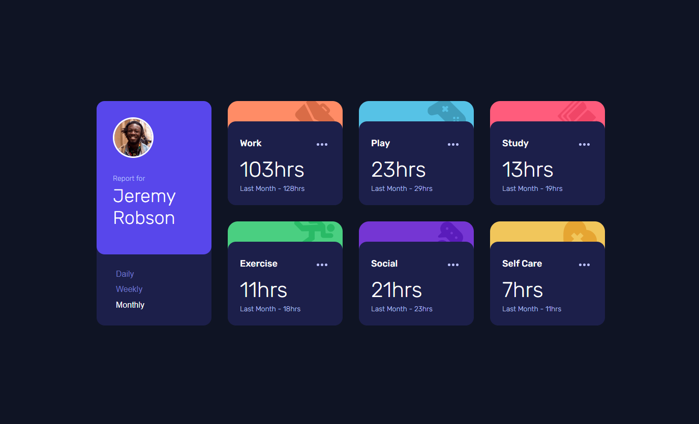

# Frontend Mentor - Time tracking dashboard solution

This is a solution to the [Time tracking dashboard challenge on Frontend Mentor](https://www.frontendmentor.io/challenges/time-tracking-dashboard-UIQ7167Jw). Frontend Mentor challenges help you improve your coding skills by building realistic projects. 

## Table of contents

- [Frontend Mentor - Time tracking dashboard solution](#frontend-mentor---time-tracking-dashboard-solution)
  - [Table of contents](#table-of-contents)
  - [Overview](#overview)
    - [The challenge](#the-challenge)
    - [Screenshot](#screenshot)
    - [Links](#links)
  - [My process](#my-process)
    - [Built with](#built-with)
    - [What I learned](#what-i-learned)
    - [Continued development](#continued-development)
  - [Author](#author)

## Overview

### The challenge

Users should be able to:

- View the optimal layout for the site depending on their device's screen size
- See hover states for all interactive elements on the page
- Switch between viewing Daily, Weekly, and Monthly stats

### Screenshot

### Links

- Solution URL: [https://github.com/oroszlanolo/FM-time-tracking-dashboard](https://github.com/oroszlanolo/FM-time-tracking-dashboard)
- Live Site URL: [https://oroszlanolo.github.io/FM-time-tracking-dashboard](https://oroszlanolo.github.io/FM-time-tracking-dashboard)

## My process

### Built with

- CSS custom properties
- Flexbox
- CSS Grid
- Mobile-first workflow
- [Angular](https://angular.io/) - JS framework

### What I learned

In this project I have learnt about background image positioning, and Typescript enum handling

### Continued development

I still need to learn what html elements to use in some cases. I use them kind of randomly right now.

## Author

- Frontend Mentor - [@oroszlanolo](https://www.frontendmentor.io/profile/oroszlanolo)
- Github - [@oroszlanolo](https://github.com/oroszlanolo)
